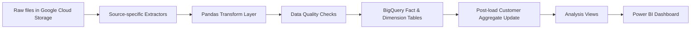

# Omnichannel Retail Data Pipeline

An end-to-end Python ELT project that consolidates omnichannel retail, payment, and customer-behavior data into a Google BigQuery warehouse for downstream analytics and Power BI reporting.

This repository is designed for technical readers who want to understand how the pipeline ingests raw data from multiple operational systems, standardizes inconsistent schemas, applies data quality checks, loads analytics-ready tables, and publishes derived views for customer journey, payment, and cashflow analysis.

## Table of Contents

- [Overview](#overview)
- [Business Context](#business-context)
- [Architecture](#architecture)
- [Data Sources](#data-sources)
- [Core Features](#core-features)
- [Warehouse Model](#warehouse-model)
- [Analytics Views](#analytics-views)
- [Repository Structure](#repository-structure)
- [Getting Started](#getting-started)
- [How to Run](#how-to-run)
- [Validation and Testing](#validation-and-testing)
- [Dashboard Outputs](#dashboard-outputs)
- [Tech Stack](#tech-stack)

## Overview

This project builds a centralized analytics layer for an omnichannel retail business operating across:

- e-commerce platforms
- offline/store systems
- direct online orders
- digital payment gateways
- bank transaction logs
- customer tracking events

The pipeline extracts raw files from Google Cloud Storage, transforms them in pandas, loads curated fact and dimension tables into BigQuery, updates customer-level aggregates, and creates reusable SQL views for BI consumption.

## Business Context

Retail and payment data often live in disconnected systems. Orders, products, payment transactions, customer information, and user behavior events usually follow different schemas, naming conventions, and quality standards. That makes reporting slow, manual, and difficult to trust.

This project addresses that problem by creating a single analytics-ready warehouse that supports questions such as:

- Which channels generate the most revenue?
- How healthy is payment collection and outstanding receivables?
- What does customer journey behavior look like before purchase?
- How does cashflow evolve over time?
- Which customers are active, loyal, VIP, or still unclassified?

## Architecture



### Pipeline Flow

1. Extract raw data from GCS using source-specific extractor classes.
2. Standardize schemas, cast types, generate surrogate keys, and handle missing values.
3. Run table-specific data quality checks before loading.
4. Load star-schema tables into BigQuery with partitioning and clustering where applicable.
5. Update customer lifetime metrics and segmentation after fact tables are loaded.
6. Create reusable analytical views for BI dashboards.

## Data Sources

The pipeline integrates multiple source families:

### Sales and Commerce

- Shopify orders
- Sapo orders and locations
- Direct online orders
- Product catalog
- Customer master data

### Payments and Banking

- MoMo
- ZaloPay
- PayPal
- Odoo / Sapo payment exports
- Mercury bank transaction logs

### Customer Behavior

- cart and browsing event tracking
- session-level events such as `view_item`, `add_to_cart`, `begin_checkout`, and `purchase`

## Core Features

- Modular OOP pipeline architecture with dedicated extractors, transformers, loader, and orchestrator
- Multi-source schema harmonization across retail, payment, and tracking systems
- Automated surrogate key generation for facts
- Shipping city and shipping address enrichment for online orders
- Built-in data quality checks for nulls, duplicates, dates, and numeric anomalies
- BigQuery loading with support for partitioning, clustering, and configurable write disposition
- Automatic customer aggregate refresh after each run
- Customer segmentation logic maintained directly in the warehouse
- Analysis-ready SQL views for journey, sankey flow, cashflow, and payment status reporting

## Warehouse Model

The BigQuery warehouse follows a star-schema style design.

### Dimension Tables

| Table | Description |
| --- | --- |
| `dim_customers` | Customer profile, geography, aggregate metrics, and segment |
| `dim_products` | Product catalog, pricing, category, brand, and stock fields |
| `dim_locations` | Store / location metadata from operational systems |
| `dim_date` | Calendar dimension with fiscal and reporting attributes |

### Fact Tables

| Table | Description |
| --- | --- |
| `fact_orders` | Unified order-level facts across channels |
| `fact_order_items` | Order line-item detail |
| `fact_payments` | Payment transactions by gateway and method |
| `fact_cart_events` | Customer behavior and funnel tracking events |
| `fact_bank_transactions` | Bank movements by account and transaction type |

### Customer Segmentation Logic

After each run, the pipeline updates customer-level metrics in `dim_customers` and reclassifies segments using warehouse-side SQL:

- `vip`: `total_orders >= 10` or `lifetime_value_vnd >= 10,000,000`
- `loyal`: `total_orders >= 5` or `lifetime_value_vnd >= 5,000,000`
- `active`: `total_orders >= 1`
- `unknown`: no qualifying purchase history or missing segment input

## Analytics Views

The pipeline creates analysis-ready views directly in BigQuery:

| View | Purpose |
| --- | --- |
| `vw_customer_journey` | Customer-level touchpoint sequence and purchase timing |
| `vw_customer_journey_sankey` | Pre-shaped edge table for Sankey journey visualizations |
| `vw_cashflow_daily` | Daily revenue, payment, and bank cashflow rollup |
| `vw_payment_status` | Order vs payment matching, delays, and outstanding amount |

These views are intended to reduce modeling effort in Power BI and keep business logic centralized in SQL where possible.

## Repository Structure

```text
.
├── config/
├── extractors/
│   ├── base_extractor.py
│   ├── customers_extractor.py
│   ├── online_orders_extractor.py
│   ├── payment_extractor.py
│   ├── products_extractor.py
│   ├── sapo_extractor.py
│   ├── shopify_extractor.py
│   ├── tracking_extractor.py
│   └── __init__.py
├── loaders/
│   ├── bigquery_loader.py
│   └── __init__.py
├── logs/
├── orchestration/
│   ├── pipeline_orchestrator.py
│   └── __init__.py
├── tests/
│   ├── fixtures/
│   ├── test_base_transformer.py
│   ├── test_bigquery_loader.py
│   ├── test_customers_extractor.py
│   ├── test_dimension_transformer.py
│   ├── test_fact_transformer.py
│   ├── test_payment_extractor.py
│   ├── test_pipeline_integration.py
│   ├── test_pipeline_orchestrator.py
│   ├── test_sapo_extractor.py
│   └── test_shopify_extractor.py
├── transformers/
│   ├── base_transformer.py
│   ├── dimension_transformer.py
│   ├── fact_transformer.py
│   └── __init__.py
├── utils/
│   ├── gcs_helper.py
│   ├── logger.py
│   └── __init__.py
├── .env
├── main.py
├── Project.pbix
├── README.md
└── requirements.txt
```

## Getting Started

### Prerequisites

- Python 3
- A Google Cloud project
- Access to:
  - Google Cloud Storage bucket with source files
  - BigQuery dataset permissions
  - a service account JSON key

### Install Dependencies

```powershell
python -m pip install -r requirements.txt
```

### Environment Variables

Create a `.env` file in the project root:

```env
GOOGLE_APPLICATION_CREDENTIALS="config/service-account.json"
GOOGLE_CLOUD_PROJECT="your-gcp-project-id"
BIGQUERY_LOCATION="US"
GCS_BUCKET_NAME="your-source-bucket"
BIGQUERY_DATASET="Ancestry"

# Optional
PIPELINE_START_DATE="2025-01-01T00:00:00Z"
PIPELINE_END_DATE="2025-12-31T23:59:59Z"
PIPELINE_HOLIDAYS="2025-01-01,2025-04-30,2025-09-02"
```

Notes:

- `PIPELINE_START_DATE` and `PIPELINE_END_DATE` are optional. If omitted, the pipeline can infer date coverage from fact data.
- The default write disposition is `WRITE_TRUNCATE`.

## How to Run

### Run With `.env` Defaults

```powershell
python main.py
```

### Run With Explicit Parameters

```powershell
python main.py `
  --project-id your-gcp-project-id `
  --dataset-id Ancestry `
  --location US `
  --bucket-name your-source-bucket
```

### Optional Flags

```powershell
python main.py `
  --start-date 2025-01-01T00:00:00Z `
  --end-date 2025-12-31T23:59:59Z `
  --holiday 2025-01-01 `
  --holiday 2025-09-02 `
  --write-disposition WRITE_TRUNCATE
```

## Validation and Testing

### Check Loaded Tables

```powershell
python check_bigquery_tables.py --dataset-id Ancestry
```

### Run the Test Suite

```powershell
python -m unittest
```

The repository includes tests for:

- extractors
- transformer logic
- BigQuery loader behavior
- pipeline orchestration
- integration-level table preparation

## Dashboard Outputs

The repository includes a Power BI report file: `Project.pbix`

The warehouse and views support dashboards such as:

- customer journey analytics
- funnel and conversion analysis
- revenue and channel breakdowns
- payment gateway performance
- receivables and collection monitoring
- cashflow and financial analytics

## Tech Stack

- Python
- pandas
- NumPy
- Google Cloud Storage
- Google BigQuery
- Power BI
- dotenv-based configuration


